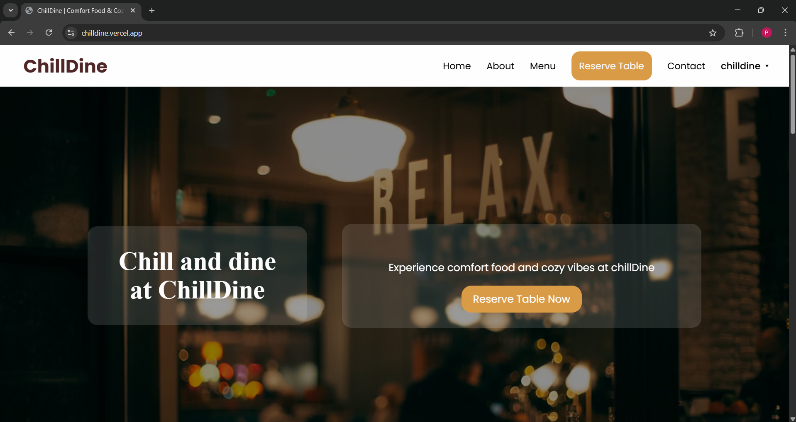
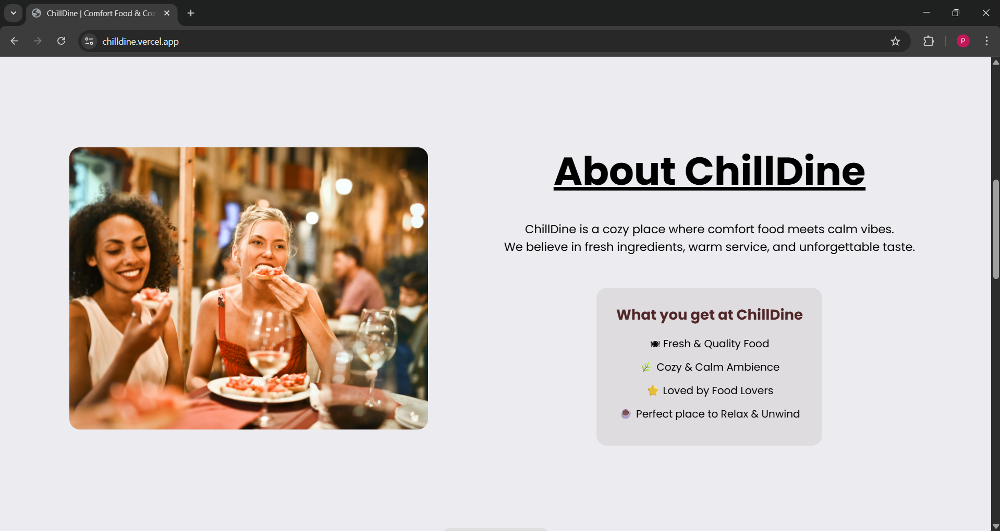
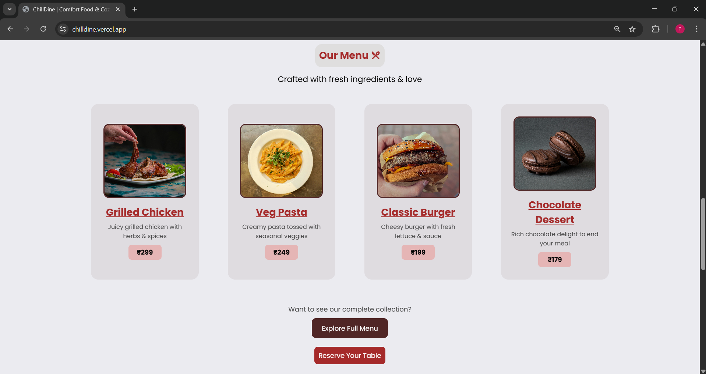
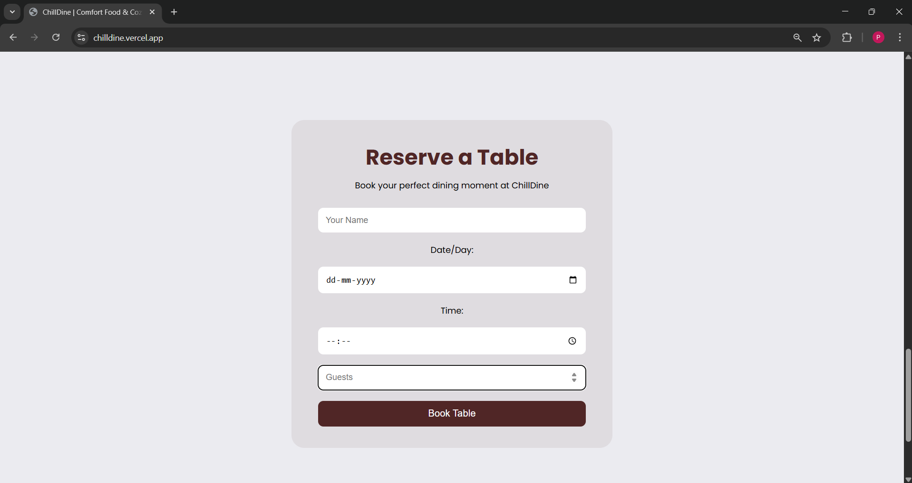
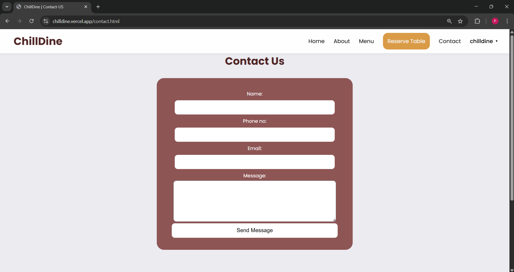
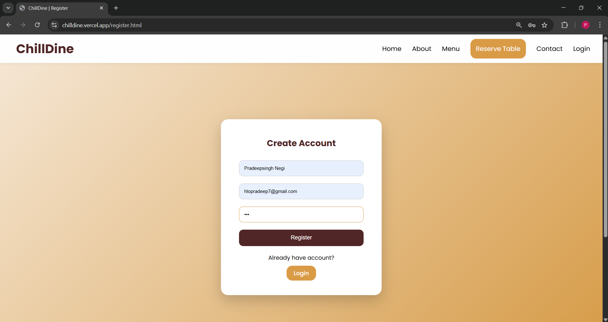
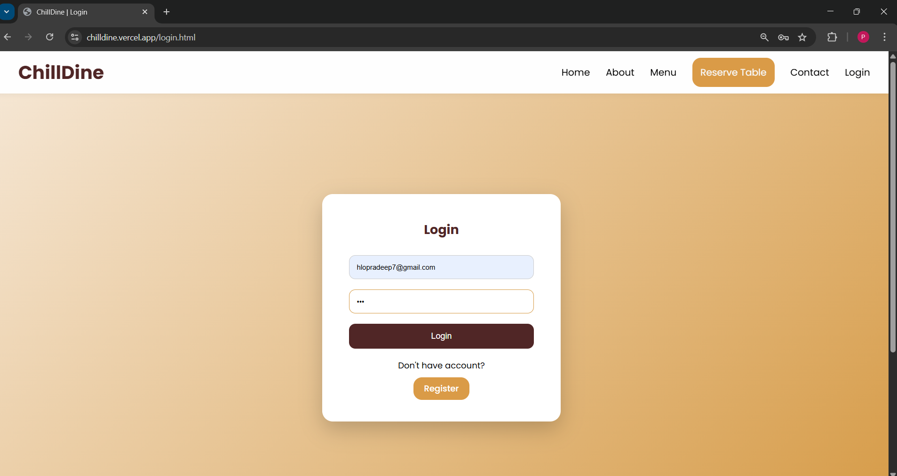

# ChillDine

ChillDine is a responsive restaurant website built using HTML, CSS, and JavaScript.

## Live Website

https://chilldine.vercel.app/

## 📸 Screenshots

### 🏠 Home Page

### 📖 About Section

### 🍽️ Menu Section

### 📅 Reservation Page

### 📩 Contact Page

### 🔐 Register Page

### 🔐 Login Page

### 📌 Footer Section

## Features

- Responsive sticky navigation bar
- User registration and login (LocalStorage based)
- Dynamic navbar with user dropdown
- Table reservation system (current year booking only)
- Full menu page with category filters
- Contact form
- Scroll animations

## Technologies Used

- HTML
- CSS
- JavaScript

## Project Structure

ChillDine/
- index.html
- login.html
- register.html
- full-menu.html
- contact.html
- style.css
- script.js
- assets/
- assets/sreenshots

## Notes

This project is built for learning purposes.  
Authentication and reservation data are stored in the browser using LocalStorage.